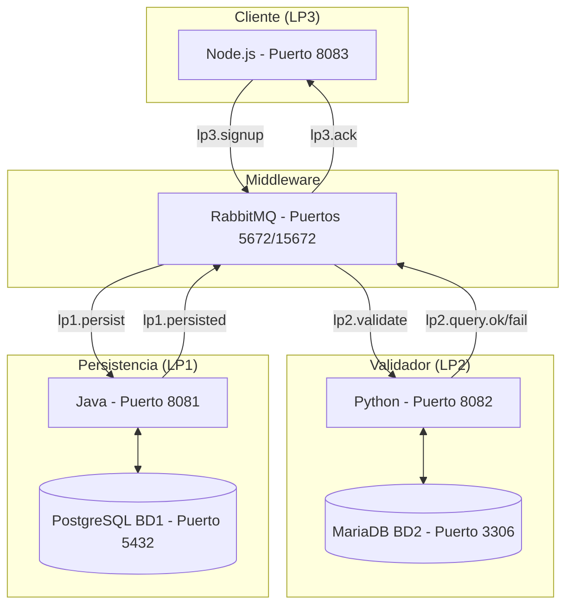

# Sistema de Registro Distribuido

Este proyecto implementa un sistema de registro distribuido que utiliza **RabbitMQ** como middleware para coordinar la comunicación entre tres lenguajes de programación diferentes, cada uno ejecutándose en nodos independientes.

## Arquitectura del Sistema



## Componentes

| Nodo | Tecnología | Puerto | Base de Datos | Función |
|------|------------|--------|---------------|---------|
| **LP1** | Java 21 | 8081 | PostgreSQL (5432) | Persistencia en BD1 |
| **LP2** | Python 3.11 | 8082 | MariaDB (3306) | Validación contra BD2 |
| **LP3** | Node.js 20 | 8083 | - | Cliente y simulador |
| **Middleware** | RabbitMQ 3.13 | 5672/15672 | - | Coordinación de mensajes |

## Flujo del Sistema

1. **LP3** envía solicitud de registro (`lp3.signup`)
2. **RabbitMQ** enruta a **LP2** para validación (`lp2.validate`)
3. **LP2** valida DNI y amigos en BD2:
   - Si es válido → envía `lp2.query.ok`
   - Si es inválido → envía `lp2.query.fail`
4. Si es válido, **RabbitMQ** enruta a **LP1** (`lp1.persist`)
5. **LP1** persiste en BD1 y confirma (`lp1.persisted`)
6. **RabbitMQ** notifica al cliente con el resultado (`lp3.ack`)

## Bases de Datos

### BD1 (PostgreSQL) - Datos de Usuario
```sql
CREATE TABLE users (
    id INT, nombre VARCHAR(512), correo VARCHAR(512),
    clave INT, dni INT, telefono INT
);

CREATE TABLE friend (
    user_id INT, friend_id INT,
    PRIMARY KEY (user_id, friend_id)
);
```

### BD2 (MariaDB) - Validación de DNI
```sql
CREATE TABLE persona (
    id INT, dni INT, nombre VARCHAR(512), apellidos VARCHAR(512),
    lugar_nac VARCHAR(512), ubigeo INT, direccion VARCHAR(512)
);
```

## Cómo Ejecutar el Sistema

### Prerrequisitos
- Docker y Docker Compose
- Puertos 3306, 5432, 5672, 8081, 8082, 8083, 15672 disponibles

### Paso 1: Levantar RabbitMQ
```bash
cd rabbitmq
docker-compose up -d
```

### Paso 2: Levantar LP2 (Python + MariaDB)
```bash
cd python
docker-compose up -d
```

### Paso 3: Levantar LP1 (Java + PostgreSQL)
```bash
cd java
docker-compose up -d
```

### Paso 4: Levantar LP3 (Node.js Cliente)
```bash
cd node
docker-compose up -d
```

### Verificación
- **RabbitMQ Management**: http://localhost:15672 (admin/admin123)
- **LP1**: http://localhost:8081
- **LP2**: http://localhost:8082  
- **LP3**: http://localhost:8083

## Simulación y Evaluación de Desempeño

### Registro Individual
```bash
docker exec -it lp3-client node app.js --mode manual
```

### Simulación de 1000 Registros
```bash
docker exec -it lp3-client node app.js --mode simulation --count 1000
```

## Métricas de Desempeño

El sistema mide:
- **Latencia promedio**: Tiempo de respuesta por solicitud
- **Throughput**: Solicitudes procesadas por segundo
- **Tasa de éxito**: Porcentaje de registros exitosos
- **Concurrencia**: Capacidad de manejar múltiples solicitudes

## Routing Keys de RabbitMQ

| Paso | Routing Key | Exchange | Emisor → Receptor |
|------|-------------|----------|-------------------|
| 1 | `lp3.signup` | `registro_bus` | LP3 → Rabbit |
| 2 | `lp2.validate` | `registro_bus` | Rabbit → LP2 |
| 3 | `lp2.query.ok/fail` | `registro_bus` | LP2 → Rabbit |
| 4 | `lp1.persist` | `registro_bus` | Rabbit → LP1 |
| 5 | `lp1.persisted` | `registro_bus` | LP1 → Rabbit |
| 6 | `lp3.ack` | `registro_bus` | Rabbit → LP3 |

## Características Técnicas

- **Sistemas Operativos**: Diferentes contenedores Linux
- **Lenguajes**: Java ≠ Python ≠ Node.js
- **Bases de Datos**: PostgreSQL ≠ MariaDB
- **Comunicación**: RabbitMQ (sin WebSockets ni Socket.IO)
- **Concurrencia**: Hilos para mejorar desempeño
- **Despliegue**: Docker Compose para cada nodo

## Estructura del Proyecto

```
pc3/
├── rabbitmq/          # Middleware RabbitMQ
├── python/            # LP2 - Validador
├── java/              # LP1 - Persistencia  
├── node/              # LP3 - Cliente
├── tarea.txt          # Especificaciones del proyecto
└── README.md          # Este archivo
```

## Validación del Sistema

1. **Verificar bases de datos**: Los cambios se reflejan correctamente
2. **Monitorear RabbitMQ**: Colas y mensajes en Management UI
3. **Revisar logs**: Cada contenedor genera logs detallados
4. **Evaluar métricas**: Resultados de la simulación de 1000 registros

---

**Equipo**: PC3  
**Arquitectura**: Sistema distribuido con 3+ nodos independientes  
**Objetivo**: Demostrar comunicación inter-lenguajes mediante middleware 